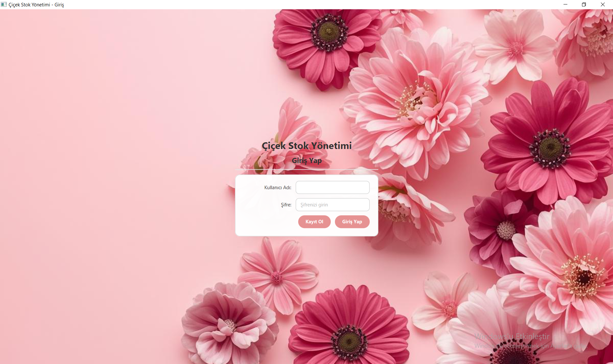
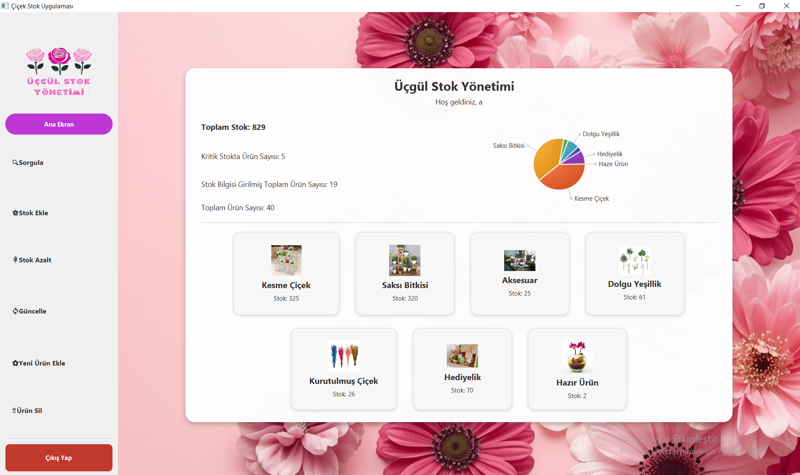

# Çiçek Stok Yönetimi

JavaFX ile geliştirilmiş, çiçekçi veya küçük ölçekli mağazalar için tasarlanmış basit bir stok yönetim uygulaması.  
Farklı çiçek kategorileri ve alt türleri için stok takibi, arama, güncelleme ve raporlama işlemlerini görsel bir arayüz üzerinden yapmayı sağlar.

---

## İçindekiler

- [Genel Bakış](#genel-bakış)
- [Özellikler](#özellikler)
- [Ekran Görüntüleri](#ekran-görüntüleri)
- [Kullanılan Teknolojiler](#kullanılan-teknolojiler)
- [Kurulum](#kurulum)
- [Kullanım](#kullanım)
- [Proje Mimarisi](#proje-mimarisi)
- [Veri Saklama Yaklaşımı](#veri-saklama-yaklaşımı)
- [Geliştirme Amacı](#geliştirme-amacı)
- [Gelecekte Geliştirilebilecek Noktalar](#gelecekte-geliştirilebilecek-noktalar)

---

## Genel Bakış

Bu proje, veritabanı kullanmadan dosya tabanlı bir yapı ile stok takibinin nasıl yapılabileceğini göstermek için geliştirilmiştir.  
Çiçek kategorileri ve alt türleri **enum** yapıları ile modellenmiş; arayüz, **JavaFX + FXML + CSS** kullanılarak tasarlanmıştır.

Uygulama ile:

- Çiçek kategorileri ve alt türleri için stok ekleme/azaltma işlemleri,
- Ürün arama ve filtreleme,
- Kategori bazlı stok dağılımını görselleştirme (PieChart),
- Yeni ürün ekleme ve ürün silme

gibi işlemler yapılabilmektedir.

---

## Özellikler

- **Giriş Sistemi**
  - Kullanıcı adı ve şifre ile giriş ekranı
  - Basit kayıt/giriş akışı

- **Dashboard / Ana Ekran**
  - Toplam stok miktarı
  - Kritik stoktaki ürün sayısı
  - Toplam ürün ve kategori sayıları
  - Kategori bazlı stok dağılımını gösteren pasta grafik
  - Her kategori için kartlar ve kategoriye ait toplam stok bilgisi

- **Ürün Sorgulama**
  - Ürün adı, kategori ve alt tür filtreleri
  - “Sadece kritik stokları göster” seçeneği
  - Tablo üzerinden tüm ürünlerin listelenmesi
  - Alt kısımda, bulunan ürün sayısı ve toplam stok bilgisi

- **Stok İşlemleri**
  - Mevcut ürünler için **stok artırma / azaltma**
  - Stok güncellendiğinde bilgilendirme mesajları
  - Stok hareketlerinin tablo üzerinden takip edilebilmesi

- **Yeni Ürün Ekleme**
  - Kategori ve birim seçimi
  - Ürün adı girme
  - Ürün için görsel dosyası seçme
  - Kayıt sonrası ürünün sistemde kullanılabilir hale gelmesi

- **Ürün Silme**
  - Kategori ve ürün seçerek kayıtlı ürünü silme
  - İşlem sonrası kullanıcıya bilgilendirme mesajı

- **Modern Arayüz**
  - Arka planda sabit çiçek görseli
  - Kart tabanlı tasarım
  - Tema uyumlu butonlar ve etiketler
  - Aynı stilin tüm ekranlarda devam etmesi

---

## Ekran Görüntüleri

> Not: Bu bölümde toplam **3 ekran görüntüsü** kullanılmıştır.  
> Resimler `docs` klasörü altında tutulmaktadır.

### 1. Giriş Ekranı

Uygulamanın açıldığında karşılayan ekran.  
Kullanıcı adı ve şifre alanları ile “Kayıt Ol” ve “Giriş Yap” butonları bulunur.

---

### 2. Ana Ekran (Dashboard)

Sol tarafta menü, ortada stok özet bilgileri ve sağda kategori bazlı stok dağılımını gösteren pasta grafik yer alır.  
Alt kısımda her kategori için kartlar ve bu kategoriye ait toplam stok bilgisi gösterilir.

---

### 3. Ürün Sorgulama Ekranı

Tüm ürünlerin listelendiği ekran.  
Üstte arama alanı, kategori ve alt tür filtreleri; altta ise ürünlerin detaylı olarak bulunduğu tablo vardır.  
“Bulunan ürün sayısı / toplam stok / kritik stokta ürün sayısı” gibi özetler tablo altında gösterilir.

---

## Kullanılan Teknolojiler

- **Dil:** Java  
- **Arayüz:** JavaFX, FXML, CSS  
- **Grafikler:** JavaFX PieChart  
- **Geliştirme Ortamı:** IntelliJ IDEA  
- **Veri Saklama:** TXT dosyaları (dosya tabanlı yapı, veritabanı yok)

---
